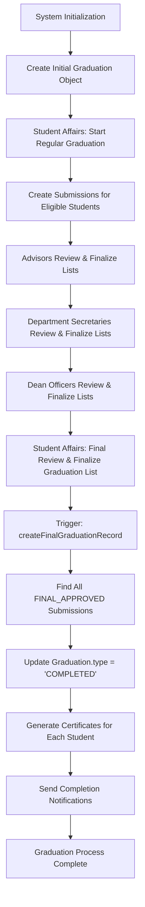

# List Finalization Implementation

## Overview

Added `isFinalized` attribute to graduation workflow lists to track completion of review processes. This ensures proper sequential approval and prevents premature completion of the graduation workflow.

## Graduation Object Creation Process

The graduation workflow involves **two types** of graduation objects:

### 1. Initial Graduation Object (Ceremony/Term Metadata)

Created during system initialization or when starting a graduation process:

```java
Graduation graduation = Graduation.builder()
    .graduationId("GRAD_2025_SPRING")
    .requestDate(new Timestamp(System.currentTimeMillis()))
    .term("Spring 2025")
    .type("REGULAR")  // Changes to "COMPLETED" when finalized
    .studentAffairs(studentAffairs)
    .build();
```

**Purpose**: Represents the graduation ceremony/term and contains metadata about the graduation process.

### 2. Final Graduation Records (Individual Certificates)

Created when Student Affairs finalizes the graduation list:

```java
// Called automatically when finalizeMyList() is invoked by Student Affairs
private void createFinalGraduationRecord(GraduationList graduationList) {
    // 1. Find all FINAL_APPROVED submissions
    List<Submission> approvedSubmissions = getAllApprovedSubmissions(graduationList);
    
    // 2. Update graduation status to "COMPLETED"
    graduation.setType("COMPLETED");
    
    // 3. Create certificates for each approved student
    for (Submission submission : approvedSubmissions) {
        createGraduationCertificate(submission, graduation);
    }
    
    // 4. Send notifications to all stakeholders
    sendGraduationCompletionNotifications(graduation, approvedSubmissions);
}
```

**Purpose**: Creates individual graduation certificates and officially marks students as graduated.

### Graduation Certificate Creation

For each approved student, the system:

1. **Generates Certificate Details**:
   ```
   GRADUATION CERTIFICATE
   Student: John Doe
   Student Number: S001
   Program: Computer Engineering
   Graduation Term: Spring 2025
   Graduation Date: 2025-01-15 10:30:00
   Certificate ID: CERT_GRAD_2025_SPRING_S001
   Status: OFFICIALLY GRADUATED
   ```

2. **Updates Submission Record**: Appends certificate information to submission content
3. **Logs Certificate Generation**: For audit trail and debugging
4. **Sends Notifications**: Email notifications to students and stakeholders

### Complete Workflow Timeline



## Changes Made

### 1. Model Updates

Added `isFinalized` boolean attribute to all list entities:

- **AdvisorList**: Tracks when advisor has completed reviewing all submissions
- **DepartmentList**: Tracks when department secretary has completed reviewing all advisor-approved submissions  
- **FacultyList**: Tracks when dean officer has completed reviewing all department-approved submissions
- **GraduationList**: Tracks when student affairs has completed the final review and graduation process is complete

Each attribute:
- Defaults to `false`
- Is non-nullable in database
- Uses `@Builder.Default` for proper initialization

### 2. Repository Enhancements

Added repository methods for finalization management:

```java
// Find lists by owner
Optional<AdvisorList> findByAdvisorEmpId(String advisorEmpId);
Optional<DepartmentList> findBySecretaryEmpId(String secretaryEmpId);
Optional<FacultyList> findByDeanOfficerEmpId(String deanOfficerEmpId);

// Update finalization status
@Modifying
@Query("UPDATE ListEntity SET isFinalized = :isFinalized WHERE id = :id")
int updateFinalizationStatus(@Param("id") String id, @Param("isFinalized") Boolean isFinalized);

// Query by finalization status
List<ListEntity> findByParentIdAndIsFinalized(String parentId, Boolean isFinalized);
boolean existsByParentIdAndIsFinalized(String parentId, Boolean isFinalized);
```

### 3. Service Layer Implementation

Added finalization methods to `SubmissionService`:

- `finalizeMyList()`: Role-agnostic finalization for current user
- `isMyListFinalized()`: Check if current user's list is finalized
- `arePrerequisiteListsFinalized()`: Check if prerequisite lists are finalized
- `unfinalizeMyList()`: Allow corrections by unfinalizing

#### Enhanced Graduation Creation Logic

**When Student Affairs finalizes graduation list**:

1. **Validation**: Ensures all prerequisites are met
2. **Submission Collection**: Gathers all FINAL_APPROVED submissions across the hierarchy
3. **Graduation Update**: Changes graduation type from "REGULAR" to "COMPLETED"
4. **Certificate Generation**: Creates individual certificates for each approved student
5. **Notification System**: Sends completion notifications to all stakeholders
6. **Audit Logging**: Comprehensive logging for the entire process

#### Finalization Logic

Each role has specific requirements before finalization:

**Advisor**:
- All submissions in advisor list must be processed (no PENDING status)

**Department Secretary**:
- All advisor lists under department must be finalized
- All submissions awaiting department review must be processed

**Dean Officer**:
- All department lists under faculty must be finalized  
- All submissions awaiting dean review must be processed

**Student Affairs**:
- All faculty lists must be finalized
- All submissions awaiting final review must be processed
- **Triggers graduation object completion and certificate creation**

### 4. Controller Endpoints

Added REST endpoints for finalization workflow:

```http
POST /api/submissions/finalize-my-list
GET  /api/submissions/my-list/finalized
GET  /api/submissions/prerequisite-lists/finalized
POST /api/submissions/unfinalize-my-list
```

All endpoints are role-protected and automatically detect the user's role.

### 5. Security & Authorization

- **ADVISOR**: Can finalize advisor lists
- **DEPARTMENT_SECRETARY**: Can finalize department lists (requires advisor lists finalized)
- **DEAN_OFFICER**: Can finalize faculty lists (requires department lists finalized)
- **STUDENT_AFFAIRS**: Can finalize graduation lists (requires faculty lists finalized) + **Creates final graduation records**

## Workflow Process

1. **Student Affairs** starts regular graduation process (creates initial graduation object)
2. **Advisors** review and approve/reject submissions, then finalize their lists
3. **Department Secretaries** review advisor-approved submissions, then finalize department lists
4. **Dean Officers** review department-approved submissions, then finalize faculty lists  
5. **Student Affairs** performs final review, finalizes graduation list, and **triggers graduation object completion**

## Database Schema Changes

The following columns are automatically added by Hibernate:

```sql
ALTER TABLE AdvisorList ADD COLUMN isFinalized BOOLEAN NOT NULL DEFAULT FALSE;
ALTER TABLE DepartmentList ADD COLUMN isFinalized BOOLEAN NOT NULL DEFAULT FALSE;
ALTER TABLE FacultyList ADD COLUMN isFinalized BOOLEAN NOT NULL DEFAULT FALSE;
ALTER TABLE GraduationList ADD COLUMN isFinalized BOOLEAN NOT NULL DEFAULT FALSE;
```

## Benefits

1. **Sequential Processing**: Ensures proper order of approvals
2. **Completion Tracking**: Clear visibility into workflow progress
3. **Error Prevention**: Prevents premature graduation completion
4. **Audit Trail**: Tracks when each level completed their review
5. **Flexibility**: Allows unfinalizing for corrections
6. **Automatic Certificate Generation**: Creates official graduation records when process completes
7. **Comprehensive Notifications**: Alerts all stakeholders when graduation is complete

## Graduation Record Details

When the graduation process completes, the system:

### Creates Individual Certificates
```
GRADUATION CERTIFICATE
Student: John Doe
Student Number: S001
Program: Computer Engineering
Graduation Term: Spring 2025
Graduation Date: 2025-01-15 10:30:00
Certificate ID: CERT_GRAD_2025_SPRING_S001
Status: OFFICIALLY GRADUATED
```

### Sends Notifications
- 📧 Email to each graduated student
- 📧 Summary report to Student Affairs
- 📧 Notifications to advisors, department secretaries, dean officers
- 🎓 Graduation completion announcement

### Updates Records
- Graduation.type changes from "REGULAR" to "COMPLETED"
- Submission content updated with certificate information
- Comprehensive audit logs created

## Usage Examples

### For Advisors
```http
# Check if my list is finalized
GET /api/submissions/my-list/finalized

# Finalize my advisor list (after reviewing all submissions)
POST /api/submissions/finalize-my-list

# Unfinalize for corrections
POST /api/submissions/unfinalize-my-list
```

### For Department Secretaries
```http
# Check if prerequisite advisor lists are finalized
GET /api/submissions/prerequisite-lists/finalized

# Finalize department list
POST /api/submissions/finalize-my-list
```

### For Student Affairs
```http
# Check if all faculty lists are finalized
GET /api/submissions/prerequisite-lists/finalized

# Complete graduation process and create final graduation records
POST /api/submissions/finalize-my-list
```

## Error Handling

The system provides clear error responses:

- **409 Conflict**: Prerequisites not met for finalization
- **404 Not Found**: User's list not found
- **403 Forbidden**: User role not authorized for operation
- **500 Internal Server Error**: Unexpected system errors

All operations are properly logged for troubleshooting. 